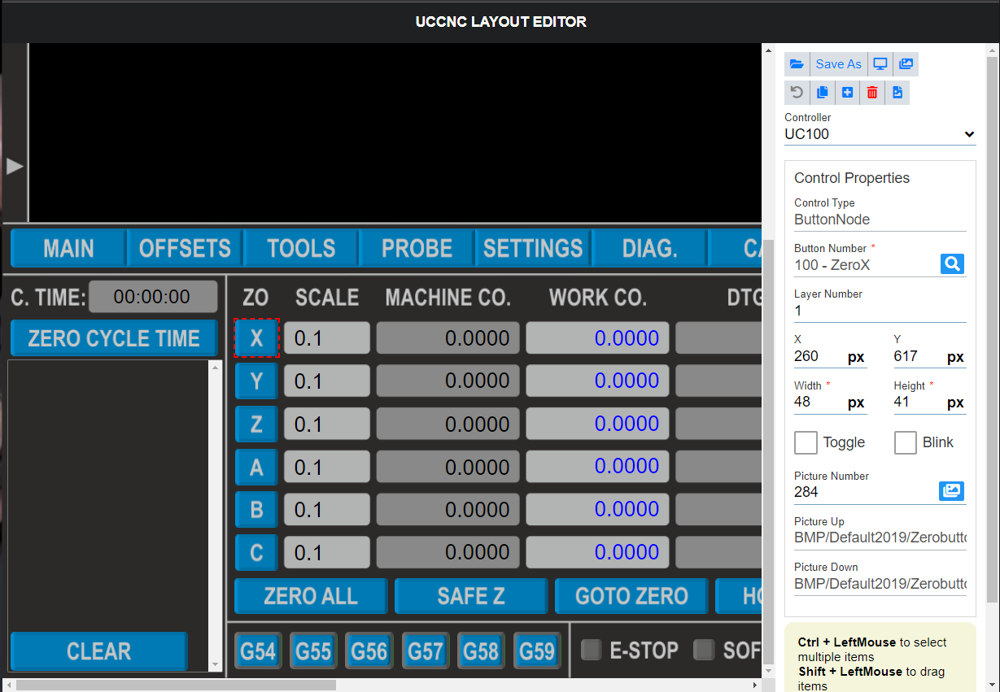

# UCCNC Screen Editor

A Web app that allows you to load and edit layout of your UCCNC screensets, generate buttons and more.

# Here is the latest version of the app: https://snapwebapps.com/uccnceditor/


  
# How to contribute.
Anyone can file a bug report or clone the repo, fix something and create a PR

# Local startup procedure
Clone the repo, run ```npm install``` command and then run the npm task ```npm run serve```
A local dev server will spin up on your port 9000: http://localhost:9000/


# UI
UI Project is the customer-facing application that presents the dialogs, offers to log in and register and performs the business functions of the app, which is editing customer's ScreeSet configurations.

## Requirements
* Node >18

## Initialization
```
cd ui
npm install
```

## Running the app
```
npm run serve
```
Launch the browser: http://localhost:9000

## Debugging the app
```
npm run serve
```
Run and Debug -> Launch Chrome 

# Testing
## UI end-to-end testing
### Install cypress
```
npm install
```
### Running tests
* To test UI run task:
   ```
   npm run test:ui
   ```


## Deployment
GitHub's Actions is used to deploy UI.
Pushing to master or merging a PR will trigger deployment.
